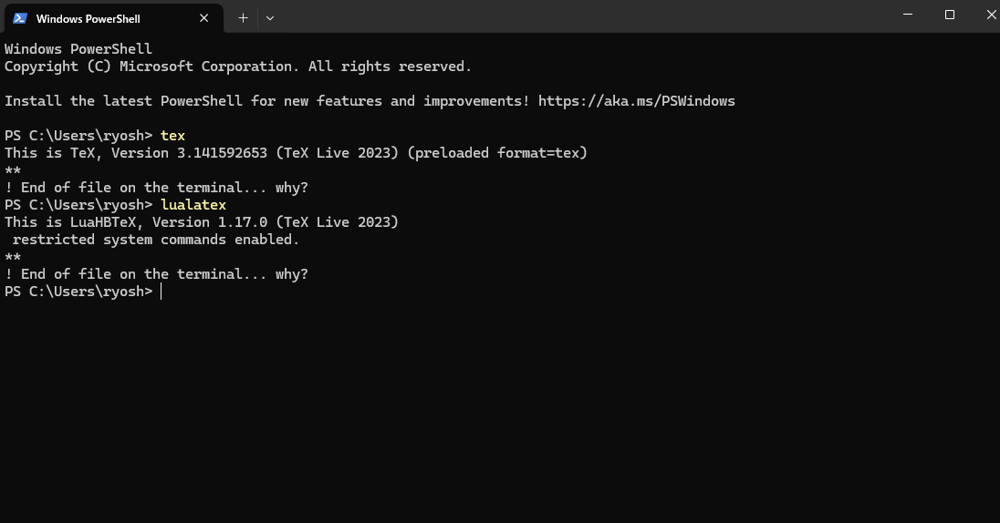

VSCodeが入っているのは前提として話を進める

# インストール

---

インストーラーをダウンロード + インストーラーを起動してインストール

[TeXLive](https://www.tug.org/texlive/acquire-netinstall.html)

容量が少ない人は以下の記事を参考してみるといいと思う

[full](https://qiita.com/SuzuTomo2001/items/07c3ba6ff9f29ebf6282)

Windowsマークの横の検索欄からcmdと検索してCommand Promptを開いてtexとlualatexがちゃんと入っているか確認

↓確認方法↓


`C:\Users\ユーザー名\`に`.latexmkrc`を作成


`.latexmkrc`を右クリックorダブルクリックしてVSCodeを開いて以下をコピペ

```sh:.latexmkrc
if ($^O eq 'MSWin32') {
  $latex = 'uplatex %O -kanji=utf8 -no-guess-input-enc -synctex=1 -interaction=nonstopmode %S';
  $pdflatex = 'pdflatex %O -synctex=1 -interaction=nonstopmode %S';
  $lualatex = 'lualatex %O -synctex=1 -interaction=nonstopmode %S';
  $xelatex = 'xelatex %O -synctex=1 -interaction=nonstopmode %S';
  $biber = 'biber %O --bblencoding=utf8 -u -U --output_safechars %B';
  $bibtex = 'upbibtex %O %B';
  $makeindex = 'upmendex %O -o %D %S';
  $dvipdf = 'dvipdfmx %O -o %D %S';
  $dvips = 'dvips %O -z -f %S | convbkmk -u > %D';
  $ps2pdf = 'ps2pdf.exe %O %S %D';
  $pdf_mode = 3;
  if (-f 'C:/Program Files/SumatraPDF/SumatraPDF.exe') {
    $pdf_previewer = '"C:/Program Files/SumatraPDF/SumatraPDF.exe" -reuse-instance';
  } elsif (-f 'C:/Program Files (x86)/SumatraPDF/SumatraPDF.exe') {
    $pdf_previewer = '"C:/Program Files (x86)/SumatraPDF/SumatraPDF.exe" -reuse-instance';
  } else {
    $pdf_previewer = 'texworks';
  }
} else {
  $latex = 'uplatex %O -synctex=1 -interaction=nonstopmode %S';
  $pdflatex = 'pdflatex %O -synctex=1 -interaction=nonstopmode %S';
  $lualatex = 'lualatex %O -synctex=1 -interaction=nonstopmode %S';
  $xelatex = 'xelatex %O -synctex=1 -interaction=nonstopmode %S';
  $biber = 'biber %O --bblencoding=utf8 -u -U --output_safechars %B';
  $bibtex = 'upbibtex %O %B';
  $makeindex = 'upmendex %O -o %D %S';
  $dvipdf = 'dvipdfmx %O -o %D %S';
  $dvips = 'dvips %O -z -f %S | convbkmk -u > %D';
  $ps2pdf = 'ps2pdf %O %S %D';
  $pdf_mode = 3;
  if ($^O eq 'darwin') {
    $pvc_view_file_via_temporary = 0;
    $pdf_previewer = 'open -ga /Applications/Skim.app';
  } else {
    $pdf_previewer = 'xdg-open';
  }
}
```

VSCode上で`Ctrl + Shift + P`で`setting`を検索して設定を開く

(`: 設定`と末尾についていればなんでもいい)


右上の黄色で囲っているアイコンをクリック


`setting.json`が開くので末尾に以下をコピペ

```json:setting.json
{
// なんかいろいろ書いてある
...,

// ここから

    // ---------- Language ----------

    "[tex]": {
        // スニペット補完中にも補完を使えるようにする
        "editor.suggest.snippetsPreventQuickSuggestions": false,
        // インデント幅を2にする
        "editor.tabSize": 2
    },

    "[latex]": {
        // スニペット補完中にも補完を使えるようにする
        "editor.suggest.snippetsPreventQuickSuggestions": false,
        // インデント幅を2にする
        "editor.tabSize": 2
    },

    "[bibtex]": {
        // インデント幅を2にする
        "editor.tabSize": 2
    },


    // ---------- LaTeX Workshop ----------


    // 生成ファイルを "out" ディレクトリに吐き出す
    "latex-workshop.latex.outDir": "out",

    // ビルドのレシピ レシピとツール内にこれらの内容を追記する。
    "latex-workshop.latex.recipes": [
            {
                "name": "Paper(ja)",
                "tools": [
                    "lualatex(ja)"
                ]
            },
        ],
        "latex-workshop.latex.tools": [
            {
                "name": "lualatex(ja)",
                "command": "lualatex",
                "args": [
                    "-synctex=1",
                    "-halt-on-error",
                    "-interaction=nonstopmode",
                    "-file-line-error",
                    "-output-directory=%OUTDIR%",
                    "%DOC_EXT%"
                ],
                "env": {}
            },
            {
                "name": "pbibtex(ja)",
                "command": "pbibtex",
                "args": [
                    "-kanji=utf8",
                    "%OUTDIR%/%DOCFILE%"
                ]
            },
        ],

// ここまでをコピペ
}
```

# テスト

--- 

`/ドキュメント`等にテスト用のフォルダを作っておく

VSCodeで左上のファイル→フォルダーを開く→テスト用フォルダを選択(※例ではtest_latex(※フォルダ名に日本語を用いない方が望ましい))


`test.tex`と`./assets/`フォルダを作る(上にある+ボタンをクリック)


`test.tex`に以下をコピペ

```tex:test.tex
\documentclass[11pt]{article}

% フォントと言語の設定
\usepackage{luatexja} % 日本語を扱うためのパッケージ
\usepackage{fontspec} % フォントを扱うためのパッケージ
\usepackage[colorlinks=true, allcolors=blue]{hyperref}
\usepackage{mathtools,amsmath,amsthm,amssymb}
\usepackage{comment}
\usepackage{comment}
\usepackage{ulem}
\usepackage{cite} %cite拡張
\usepackage{latexsym} %記号追加
\usepackage{enumerate}	%列挙用
\usepackage{setspace} %余白制御
\usepackage{multirow}
\usepackage{luatexja-preset}
\usepackage{listings, jvlisting}
\usepackage{subcaption}
\usepackage{siunitx}
\usepackage{float}
\usepackage{tikz}

\usetikzlibrary{shapes, arrows}

% 数学関連のパッケージ
\usepackage{amsmath}
\usepackage{amsfonts}
\usepackage{amssymb}

% グラフィックス関連のパッケージ
\usepackage{svg}
\usepackage[]{graphicx}

% ページレイアウトの調整（必要に応じて変更してください）
\usepackage[top=10truemm,bottom=25truemm,left=25truemm,right=25truemm]{geometry}

% \geometry{
%     a4paper,
%     margin=25truemm
% }

% タイトル日付が邪魔だったら\date{}でいい
\title{タイトル}
\author{著者名}
\date{\today}


\begin{document}
\maketitle

\section{新しいアプローチの提案}

このセクションでは、私たちは新しいアプローチを提案します。我々の方法論は、データの分析と予測能力を高めるための革新的な手法を採用しています。具体的には、機械学習アルゴリズムを組み合わせたデータ処理パイプラインを構築し、リアルタイムでのデータ解析を可能にすることを目指しています。

\subsection{提案手法}

提案手法の主な特徴は以下のとおりです：
\begin{itemize}
    \item データの前処理と特徴エンジニアリングにおける新しいアプローチの導入
    \item 深層学習モデルとアンサンブル学習の組み合わせによる高精度な予測
    \item ストリーミングデータに対するリアルタイムでの処理と分析能力の向上
\end{itemize}

我々の提案手法は、従来の手法と比較して明確な利点をもたらすことが期待されます。実験結果から、提案手法は高い精度と効率性を示し、実世界のデータ解析タスクにおいて有望なアプローチであることが示されています。

% 画像の挿入
\begin{figure}[htbp]
    \centering
    \includegraphics[width=0.5\textwidth]{assets/graph.png} % 画像ファイル名を指定してください
    \caption{データのグラフ}
    \label{fig:graph}
\end{figure}

\section{実験と評価}

ここでは、我々の提案手法の有効性を検証するために行った実験とその評価について議論します。具体的には、様々なデータセットとメトリクスを用いて提案手法を評価し、その性能を従来の手法と比較しました。実験結果から、提案手法が高い精度と効率性を示すことが確認されました。

\end{document}
```

また、`assets`フォルダに以下の画像を入れてください


`Ctrl + S`で保存 or 黄緑の▷アイコンをクリックしたら`./out/`にpdfが吐き出される

成功したら黄色で囲ったアイコンをクリックすると右側にプレビューが出てくるはず


↓予想状態↓


また,様々な形式のテンプレートはOverleaf等に公開されているので調べてみるとよい

[overleaf](https://ja.overleaf.com/latex/templates/tagged/lualatex)

# IguanaTeXインストール(おまけ)

---

PowerPointにTeXをpdfとして挿入できるようになる.具体的には以下のようなことが数式エディタを使わずにできるようになる.


`C:/`直下に`C:/temp/`フォルダを作っておく

以下のGitHubからアドイン(Add-in for Windowsの最新ver)をダウンロードして`C:/Users/ユーザー名/AppData/Roaming/Microsoft/AddIns/`に入れる


[download](https://github.com/Jonathan-LeRoux/IguanaTex/releases)

PowerPointを開いて ファイル → オプション → アドイン を選択

PowerPointアドインの右横にある設定 → 新規追加 → `C:/Users/user/AppData/Roaming/Microsoft/AddIns/IguanaTex*.ppam` を選択

↓のような警告が出たらマクロを有効にするを選択


閉じるとタスクバーにIguanaTeXが追加されているはず


画像変換に必要な**Ghostscript**と**ImageMagick**のWindows用Installerをダウンロードして実行

**Ghostscript Installer**

[Ghostscript](https://ghostscript.com/releases/gsdnld.html)


**ImageMagick Installer**(Windows Installerはかなり下にあるので注意)

[ImageMagick](https://imagemagick.org/script/download.php)

IganaTeX -> Main Settingを選択


Main settingの黄色の丸がついている場所がいろいろおかしくなっているので修正

上から

- 一番最初に作った`C:/temp/`選択
- LaTeX Engineを`platex`に指定
- GhostscriptのPathを指定,画像を参考に`gwin64c.exe`を指定
- ImageMagickのPathを指定,画像を参考に`magick.exe`を探して指定


## おすすめの使い方

あらかじめ出力したい式をVSCodeで書いて出力しておきます


コードも示しておきます

```tex
% LuaLaTeX文書の基本テンプレート
\documentclass[11pt,a4paper]{article}

% フォントと言語の設定
\usepackage{luatexja} % 日本語を扱うためのパッケージ
\usepackage{fontspec} % フォントを扱うためのパッケージ
\usepackage[colorlinks=true, allcolors=blue]{hyperref}
\usepackage{mathtools,amsmath,amsthm,amssymb}
\usepackage{comment}
\usepackage{comment}
\usepackage{ulem}
\usepackage{cite} %cite拡張
\usepackage{latexsym} %記号追加
\usepackage{enumerate}	%列挙用
\usepackage{setspace} %余白制御
\usepackage{multirow}
\usepackage{luatexja-preset}
\usepackage[top=15truemm,bottom=25truemm,left=25truemm,right=25truemm]{geometry}
\usepackage{graphicx}
\usepackage{listings, jvlisting}
\usepackage{subcaption}
\usepackage{siunitx}
\usepackage{float}


% 余白の設定
\usepackage{geometry}
\geometry{left=25mm,right=25mm,top=30mm,bottom=30mm}

% 数学関連のパッケージ
\usepackage{amsmath}
\usepackage{amsfonts}
\usepackage{amssymb}

\begin{document}


\begin{align*}
  e^{j \theta} = \cos{\theta} + j\sin{\theta}
\end{align*}

\begin{align*}
  e^{j \pi} + 1 = 0
\end{align*}


\end{document}
```

New LaTeX displayを選択


以下のようなポップアップが出てくるので`\begin{document}`~`\end{document}`の間に例に示した`\begin{align*}`~`\end{align*}`をコピペ & Generateをクリック


なんということでしょうオイラーの公式が出力されました


**間違えちゃった！！**というときは


間違えたものを選択してEdit LaTeX displayから修正できます


