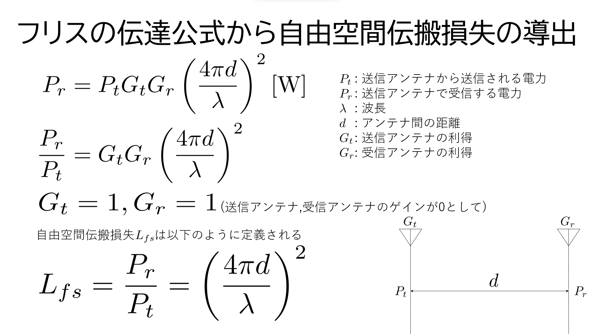
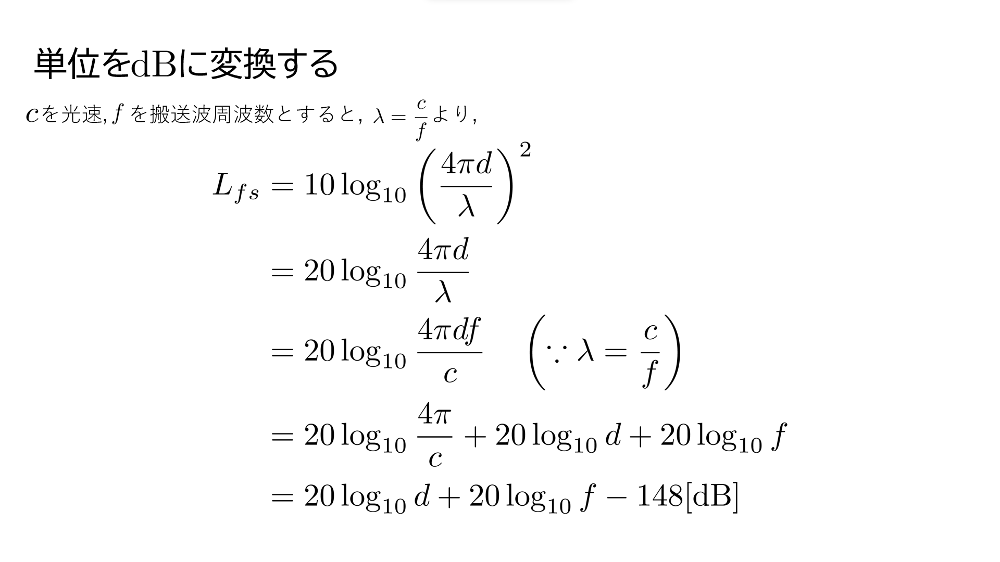

実装されていないものもあるが、以下の記事を参考にすると良い

[Qiita](https://qiita.com/Qiita/items/c686397e4a0f4f11683d)

この記事には実装されている物のみ示していく


# 1. 見出し

---

**書き方**

```markdown:書き方.md
# これは H1 タグです

## これは H2 タグです

## これは H3 タグです
```

**結果**

# これは H1 タグです

## これは H2 タグです

## これは H3 タグです


# 2. コードの挿入

---

## Code blocks - コードブロック

**書き方**

````python
```python:test.py
print('Hello')
print('World')
```
````

**結果**

```python
print('Hello')
print('World')
```

## Code spans - コードスパン

**書き方**

```markdown
`puts 'ShitaLab'`と書くことでインライン表示することが可能
```

**結果**
`puts 'ShitaLab'`と書くことでインライン表示することが可能


# 3. Format Text - テキストの装飾

---

## Emphasis / Strong Emphasis - 強調・強勢

**書き方**

```markdown
\ か * で囲むと HTML の em タグになります。Qiita では *italic type* になります。
\\ か ** で囲むと HTML の strong タグになります。Qiita では **太字** になります。
```

**結果**

\ か * で囲むと HTML の em タグになります。ShitaLab HPでは *italic type* になります。
\\ か ** で囲むと HTML の strong タグになります。ShitaLab HP では **太字** になります。

## Strikethrough - 打ち消し線

**書き方**

```markdown
打ち消し線を使うには ~~ で囲みます。 ~~打ち消し~~
```

**結果**

打ち消し線を使うには ~~ で囲みます。 ~~打ち消し~~


# 4. Lists - リスト

---

## Bullet List - 順序なしリスト

**書き方**

```markdown
- 文頭に`*` `+` `-`のいずれかを入れると順序なしリストになります
+ 要点をまとめる際に便利です
* `*` `+` `-`の後には **スペースが必要です**
    - ネストもできます
```

**結果**

- 文頭に`*` `+` `-`のいずれかを入れると順序なしリストになります
+ 要点をまとめる際に便利です
* `*` `+` `-`の後には **スペースが必要です**
    - ネストもできます


# 5. Horizontal rules - 水平線

---

**書き方**

```markdown
---
これら
* * *
全て
***
水平線
*****
になる
- - -
```

**結果**

---
これら
* * *
全て
***
水平線
*****
になる
- - -


# 6. Links - リンク

---

なんと素晴らしいことにリンクを貼るとメタデータを取得していい感じのBoxにしてくれる

**書き方**

```markdown
[神記事](https://qiita.com/ryo-ww/items/7c2b8a7519bd9a06dfd9)
```

**結果**

[神記事](https://qiita.com/ryo-ww/items/7c2b8a7519bd9a06dfd9)

# 7. Images - 画像埋め込み

---

画像を使うときは同じ階層に.mdと同じ名前のフォルダを作ってその中に画像を入れる(今回の場合はMarkdown記法というフォルダを作る)

つまり以下のようなディレクトリ構造にする


```txt
/public/md/
├── Markdown記法.md
└── Markdown記法/
    ├── Friis_transmission_equation.png
    └── to_dB.png

```

**また、画像のパスの指定の仕方は`フォルダ名/画像の名前`にしてください(`./`等は入れないようにしてください)**

**書き方**

```markdown
## タイトルありの画像を埋め込む


## タイトル無しの画像を埋め込む

```

```markdown



```

**結果**


# 8. Formula - 数式

---

## 数式の挿入

コードブロックの言語指定に`math`を指定するか`$$`で囲むことでKaTeX記法を用いて数式を記述することができる

数式の書き方は自分で調べてほしい

````markdown
```math
\left( \sum_{k=1}^n a_k b_k \right)^{\!\!2} \leq
\left( \sum_{k=1}^n a_k^2 \right) \left( \sum_{k=1}^n b_k^2 \right)
```

# 式番号を入れたいとき

```math
\begin{align}
  L_{fs} = \frac{P_r}{P_t} = \left(\frac{4 \pi d}{\lambda}\right)^2 
\end{align}
```

# alignを使うと=の位置を合わせられる

$$
\begin{align*}
  L_{fs} &= 10 \log_{10} \left(\frac{4 \pi d}{\lambda}\right)^2\\
&= 20 \log_{10} \frac{4 \pi d}{\lambda} \\
  &= 20 \log_{10} \frac{4 \pi d f}{c} \quad \left(\because \lambda = \frac{c}{f}\right)\\
  &= 20 \log_{10} \frac{4 \pi}{c} + 20 \log_{10} d + 20 \log_{10} f\\
  &= 20 \log_{10} d + 20 \log_{10} f - 148[\mathrm{dB}]\\
\end{align*}
$$
````

**結果**

```math
\left( \sum_{k=1}^n a_k b_k \right)^{\!\!2} \leq
\left( \sum_{k=1}^n a_k^2 \right) \left( \sum_{k=1}^n b_k^2 \right)
```

$$
\begin{align}
  L_{fs} = \frac{P_r}{P_t} = \left(\frac{4 \pi d}{\lambda}\right)^2 
\end{align}
$$

$$
\begin{align*}
  L_{fs} &= 10 \log_{10} \left(\frac{4 \pi d}{\lambda}\right)^2\\
&= 20 \log_{10} \frac{4 \pi d}{\lambda} \\
  &= 20 \log_{10} \frac{4 \pi d f}{c} \quad \left(\because \lambda = \frac{c}{f}\right)\\
  &= 20 \log_{10} \frac{4 \pi}{c} + 20 \log_{10} d + 20 \log_{10} f\\
  &= 20 \log_{10} d + 20 \log_{10} f - 148[\mathrm{dB}]\\
\end{align*}
$$

## インライン表示

`$2^3$` のように数式を "$" で挟むと行中に数式を埋め込むこともできる

**書き方**

```markdown
x^2 + y^2 = 1 をインライン表示すると $x^2 + y^2 = 1$ になります。

$R_{1}$のように文中に下付き文字を作りたい場合にも使えます

単位($\mathrm{[m/s]}$,$\mathrm{[dB]}$)や一般的な記号($f = \mathrm{c \cdot \lambda}$)は`mathrm`を使いましょう
```

**結果**

x^2 + y^2 = 1 をインライン表示すると $x^2 + y^2 = 1$ になります。

$R_{1}$のように文中に下付き文字を文中に作りたい場合にも使えます

単位($\mathrm{[m/s]}$,$\mathrm{[dB]}$)や一般的な記号($f = \mathrm{c \cdot \lambda}$)は`mathrm`を使いましょう

# 絵文字

---

厳密には Markdown 記法の外ですが、`:` で囲って、Emojiを埋め込めます
ただし、反映されるものとされないものがあるので気を付けてください

以下のようなサイトからコピペしてくるといいと思う

[Emoji](https://www.webfx.com/tools/emoji-cheat-sheet/)

**書き方**

```markdown
:warning:
:kissing_closed_eyes: chu☆
🫠
🔰
♻
😇
```

**結果**

:warning:
:kissing_closed_eyes: chu☆
🫠
🔰
♻
😇

# その他

---

バックスラッシュ`\`をMarkdownの前に挿入することで、Markdownをエスケープ(無効化)することができます

```markdown
\# H1 エスケープされています
```

\# H1 エスケープされています

# 改善したい場合

---

このサイトでなにかムカついた事があった場合やリファクタリングしたい場合は頑張ってReact + TypeScript + Vite + Chakra UI(ver 2.8)を習得してHomeページからShitaLabリポジトリを編集してください

[ShitaLab](https://ryoww.github.io/ShitaLab/)

