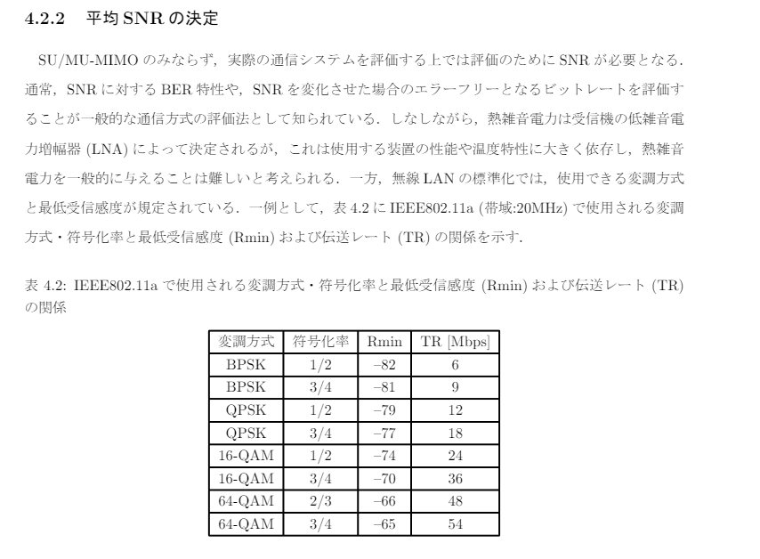
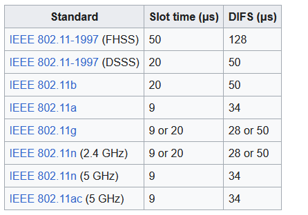
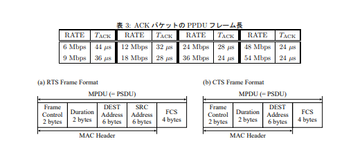
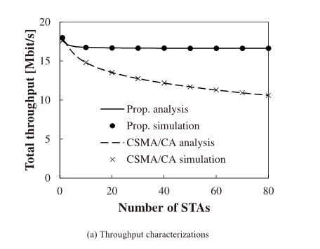

# 要件定義

**MATLAB 2024a**使用

秒[s]の単位を[μs]で統一

-   CSMA/CA の再現
-   パケットを任意長
-   ユーザーを任意数

-   命名記法

    -   関数名 大文字\_小文字
        -   SET_difs
    -   変数名 小文字\_小文字
        -   time_difs
    -   定数名　大文字\_大文字
        -   CW_MIN

-   検証方法
    -   スループットの計算
        -   決められたパケット量をすべて送信できるまでの時間でパケット量を割る
    -   送信中の可視化したい

CW は整数(スロットタイムの数)で扱う

# MATLAB パケット生成

以下でパケットを作成

FrameType 引数：`'RTS', 'CTS', 'ACK', 'Block Ack', 'Trigger', 'Data', 'Null', 'QoS Data', 'QoS Null', 'Beacon’`

```m
wlanMACFrameConfig(FrameType="QoS Null");
```

作られたパケットは frame,と frameLength に格納される

```m
[frame,frameLength] = wlanMACFrame(cfgMAC,OutputFormat="octets");
```

frame はオクテットごとの配列なので任意に編集できる(どう編集したいかによって変わる)

[wlanMACFrame](https://jp.mathworks.com/help/wlan/ref/wlanmacframe.html)

# 必要な情報

### $\mathrm{R_{min}}$がシミュレーターから出てくるのでそれに対応した伝送レート(TR)になる



### モードに対応するスロットタイムの値



### ACK フレーム長



# 理論値

この値を 30 台で実現することが目標


